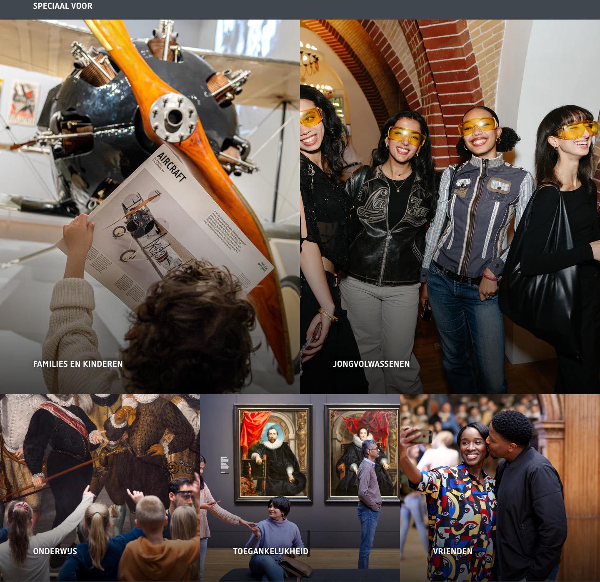

# Category Link Grid

**Used on:** Agenda / What's On Listing (2 instances, back-to-back)
**Class:** `link-section`

A titled group of text links with no imagery — the plainest component found in this test run. Each instance has a heading and a short flat list of links.

Instances observed:
- **"Speciaal voor"** ("Especially for"): Families en kinderen, Jongvolwassenen, Onderwijs, Toegankelijkheid, Vrienden (5 links)
- **"Cursussen, workshops en lezingen"** ("Courses, workshops and lectures"): Cursussen, Workshops, Lezingen/symposia/filmvertoningen (3 links)

## Content pattern

Functions as a category/audience router at the bottom of the listing page — grouping links by who they're for (first instance) vs. what type of activity they are (second instance).
