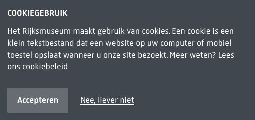

# Cookie Bar

**Used on:** Every page, on a visitor's first load — shown once per session, then dismissed for the rest of the visit. Captured here from the "Zien & doen" page, since that's whichever page happened to load first in this crawl.

Bottom-left corner card, appears over the page content rather than a full-width bar. Heading ("Cookiegebruik"), a short explanation with a "cookiebeleid" (cookie policy) link, and two buttons: a filled "Accepteren" (secondary-styled, not the site's orange CTA color) and a plain text "Nee, liever niet" (reject) link beside it.

## Measured styles

- Background: dark slate (`rgb(64,71,79)`) — the only dark-gray-on-white surface anywhere on the site, distinct from the header/footer's black or transparent treatment
- Text color: white (`rgb(255,255,255)`)
- Font: `RijksText, Arial, sans-serif`, 16.9px, weight 400
- Padding: 15px
- No border radius (square corners)
