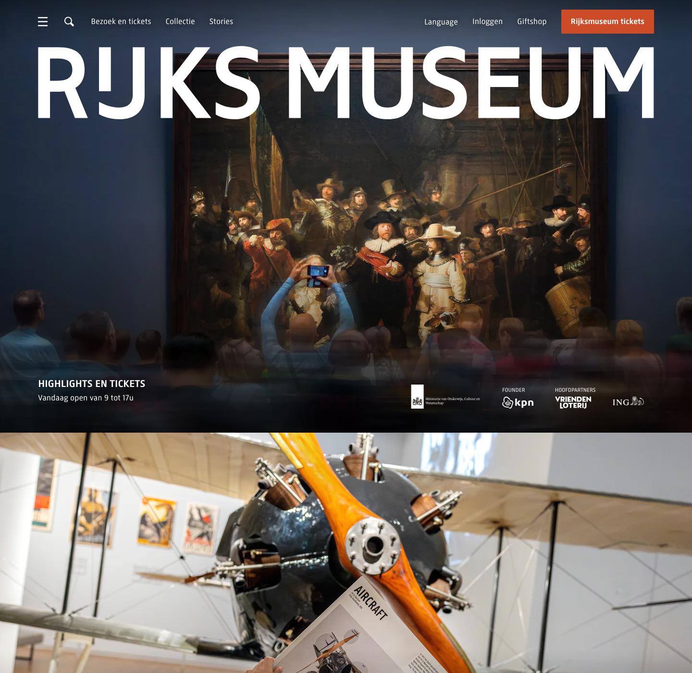

# Full-Width Promo Block

**Used on:** Homepage (3 instances, including a hero variant)
**Class:** `block-full-width-overflow`

A full-bleed background image with a short eyebrow label and headline overlaid in the bottom-left corner, the entire block acting as one link through to an exhibition, story, or feature. No body copy — this component is a visual entry point, not a content container.

Preview below shows the hero variant (top of the homepage); the [full homepage screenshot](../../pages/nl/screenshot.png) shows all 3 instances in context.

Examples seen: the homepage hero ("RIJKSMUSEUM" wordmark over *The Night Watch*), a "Families en kinderen" promo, and a "Fiep Westendorp" exhibition promo.

## Variants observed

- **Hero variant** (`page-header-home`): same visual shape, but placed directly under the header/sponsor strip and carries the site wordmark instead of a normal headline. Structurally it's the same block type with a modifier class, not a different component.
