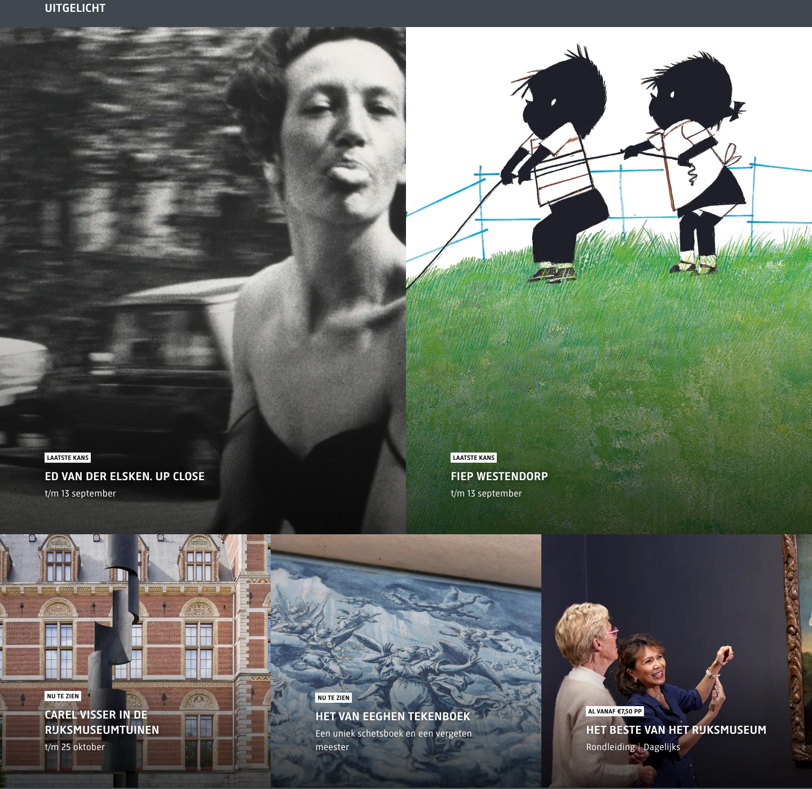

# Highlights Carousel

**Used on:** Agenda / What's On Listing
**Class:** `whatson-highlights`

A grid/carousel of current exhibitions, tours, and activities. Each card has an image, a status tag (e.g. "LAATSTE KANS" / "Last chance", "NU TE ZIEN" / "On view now"), a title, and a short secondary line — either a date range ("t/m 13 september") or a price ("Al vanaf €7,50 pp"). A "Zie alle" (See all) link sits above the grid alongside sub-links to "Tentoonstellingen" and "Rondleidingen".

## Content pattern

Mixes two distinct card types under one visual system: time-limited exhibitions (date-driven) and always-available experiences like guided tours (price-driven) — the status tag is what tells them apart, not the layout.
