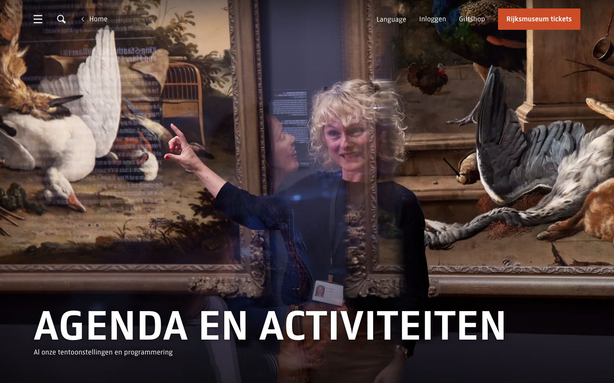
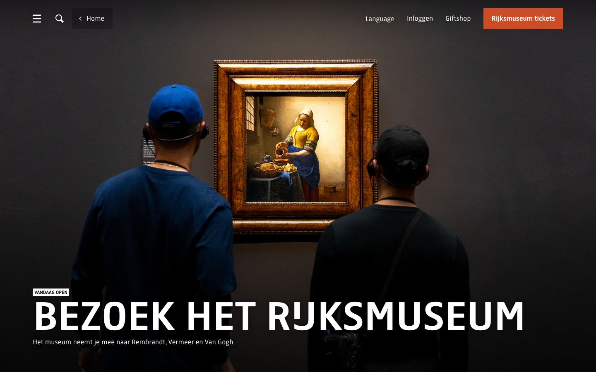

# Page Header Banner

**Used on:** Agenda / What's On Listing, Visitor Info Page
**Class:** `page-header block-full-width-overflow`

Full-width banner used at the top of interior (non-homepage) pages: a full-bleed photo with the page's H1 title overlaid in large white type, plus a short one-line subtitle/description. Fixed height (900px in both instances measured).

**Agenda variant** (plain — title + subtitle only):

**Visitor Info variant** (with pricing box and secondary link):

## Variants observed

- On the **Visitor Info** page, this component also carries a compact pricing summary box (e.g. "Volwassenen €25 / t/m 18 jaar Gratis") and a secondary link ("Praktische informatie") docked beside the intro text — the **Agenda** page's instance is plainer, title + subtitle only, no pricing box. Worth confirming with a larger sample whether the pricing box is specific to ticketed/visit-related pages or a general optional slot in this component.
