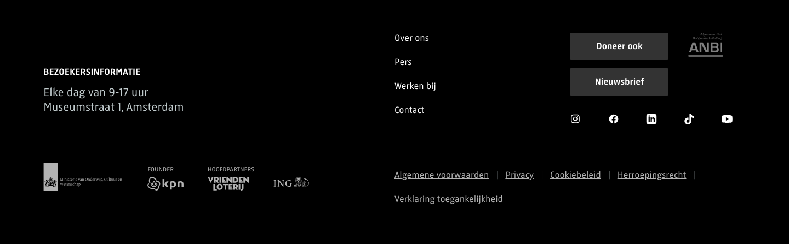

# Site Footer

**Used on:** Homepage, Agenda / What's On Listing, Visitor Info Page (all 3 pages in this test run — identical on all three)

Solid black footer, the only section on any of these pages with a fully opaque non-transparent background. Contains, top to bottom: visiting hours and address ("Bezoekersinformatie" — Elke dag van 9-17 uur, Museumstraat 1, Amsterdam), a set of primary links (Over ons, Pers, Werken bij, Contact), two buttons ("Doneer ook" / "Nieuwsbrief"), an ANBI charity registration badge, social media icons (5), a row of sponsor/partner logos, and a final row of secondary/legal links.

## Measured styles

- Background: solid black (`rgb(0,0,0)`)
- Text color: white (`rgb(255,255,255)`)
- Font: `RijksText, Arial, sans-serif`, 17.4px
- Identical on all 3 captured pages — 21 links, 10 images, 447px tall in every case, confirming this is a single shared, non-page-specific component.
