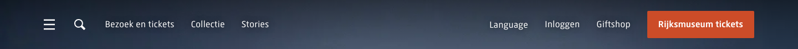

# Site Header / Navigation

**Used on:** Homepage, Agenda / What's On Listing, Visitor Info Page (all 3 pages in this test run)

Persistent top navigation, transparent background over the page content (no white bar). Left side: hamburger menu icon, search icon, a "back" breadcrumb-style link on interior pages (e.g. "‹ Home" on the Bezoek and Agenda pages, absent on the homepage itself). Right side: language switcher, login, giftshop link, and a filled orange "Rijksmuseum tickets" call-to-action button that's visually distinct from the rest of the nav (only colored element in the header).

## Measured styles

- Font: `RijksText, Arial, sans-serif`, 17.4px, weight 400
- Text color: white (`rgb(255,255,255)`)
- Background: transparent (`rgba(0,0,0,0)`) — relies on the page content behind it for contrast
- Padding: 20px top/bottom

## Variants observed

- Link count varies by page (25–37 `<a>` tags counted) — the homepage's header has fewer links than interior pages, likely due to an additional in-page breadcrumb/back link present only on non-homepage pages.
