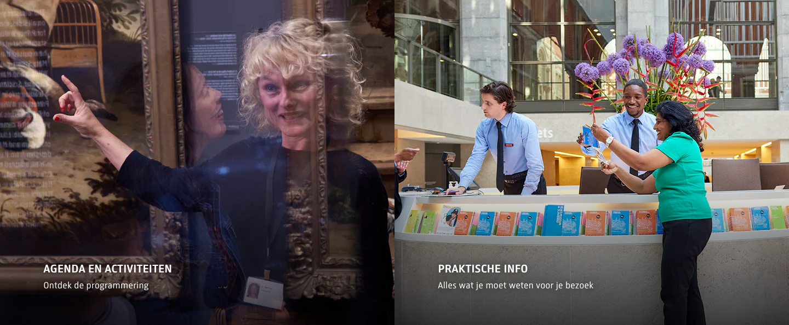

# Two-Up Content Row

**Used on:** Homepage, Visitor Info Page
**Class:** `related-content block-row`

The Homepage variant (the Ed van der Elsken exhibition/shop pair) is visible in the [full homepage screenshot](../../pages/nl/screenshot.png) — it wasn't cropped separately since it sits nested inside the homepage's single wrapping section (see note below).

Two side-by-side half-width tiles, each image-led with a short title beneath. Confirmed as the **same canonical component reused for two different jobs**: on the Homepage it pairs an exhibition promo with its companion shop/book promo (content marketing), while on the Visitor Info page it's repurposed as a simple 2-item navigation shortcut (Agenda, Praktische info). This is exactly the kind of structural match across differently-named contexts that reconciliation is meant to catch — the automated pass missed it (it only compared elements one level deep under `<main>`, and the homepage instance sits nested inside the homepage's single wrapping section), but the markup and class name are identical between the two.

## Variants observed

- Content role varies (promotional vs. navigational) but the visual/structural shape — two equal-width image tiles side by side — is identical.
