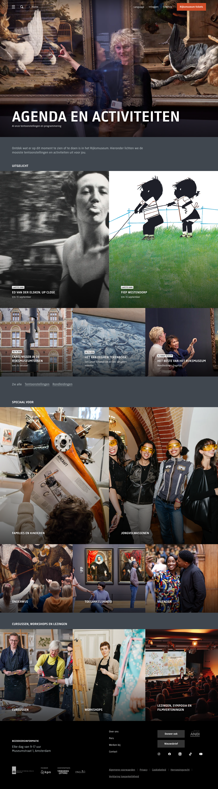

# Agenda / What's On Listing

**URL:** `/nl/zien-en-doen` (page title: "Agenda en activiteiten") · **Occurrences:** 1 in this test run

A hub/listing page: less about one specific thing, more a jumping-off point into everything currently on at the museum, exhibitions, tours, courses, talks. Structurally lighter than the Visitor Info page: no scroll-hijacked components, straightforward vertical sections.

## Section outline (top to bottom)

1. **[Site Header / Navigation](../components/site-header.md)**
2. **[Page Header Banner](../components/page-header-banner.md)**: "Agenda en activiteiten" title over a full-width photo, subtitle "Al onze tentoonstellingen en programmering" ("All our exhibitions and programming").
3. **[Text Intro Block](../components/text-intro-block.md)**: one short paragraph orienting the visitor, no heading of its own.
4. **[Highlights Carousel](../components/highlights-carousel.md)** ("Uitgelicht" / "Featured"): a grid of current exhibitions and activities, each with a status tag ("Laatste kans" / "Last chance", "Nu te zien" / "On view now"), title, and a short date or price line.
5. **[Category Link Grid](../components/category-link-grid.md)**: "Speciaal voor" ("Especially for"): Families en kinderen, Jongvolwassenen, Onderwijs, Toegankelijkheid, Vrienden.
6. **[Category Link Grid](../components/category-link-grid.md)**: second instance, "Cursussen, workshops en lezingen" ("Courses, workshops and lectures"): Cursussen, Workshops, Lezingen/symposia/filmvertoningen.
7. **[Site Footer](../components/site-footer.md)**

## Content pattern

This page is built from two repeating list-like components (Highlights Carousel and Category Link Grid) sandwiched between a banner and a footer. It's a hub, not a story. The Category Link Grid appears twice back-to-back with different headings and link sets, confirming it's a reusable component rather than a one-off section.
