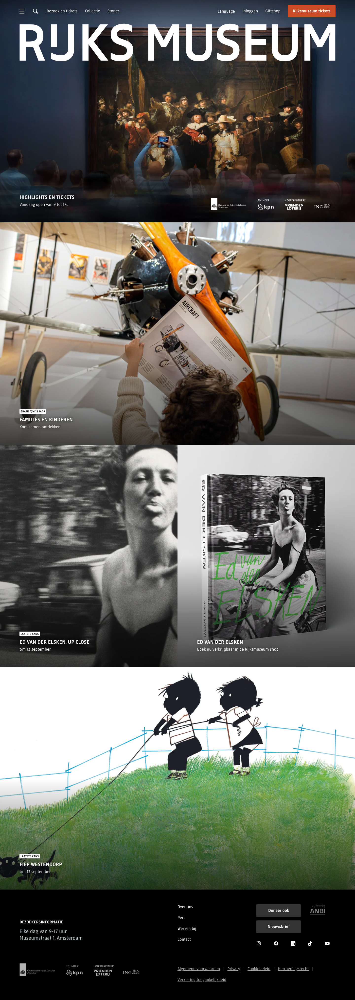

# Homepage

**URL:** `/nl` · **Occurrences:** 1 (unique page)

The main landing page. A dark, image-forward layout stacking full-bleed promotional blocks: no sidebar, no dense text; the page is almost entirely large photography with short headline overlays.

## Section outline (top to bottom)

1. **[Site Header / Navigation](../components/site-header.md)**: logo, primary nav, ticket CTA.
2. **[Sponsor Logo Strip](../components/sponsor-logo-strip.md)**: 3 funder/partner logos in a row, directly under the header.
3. **Hero block** (`page-header-home`, a variant of the [Full-Width Promo Block](../components/full-width-promo-block.md)): full-bleed photo of Rembrandt's *The Night Watch* with "RIJKSMUSEUM" wordmark and "Highlights en tickets" label overlaid.
4. **[Full-Width Promo Block](../components/full-width-promo-block.md)**: "Families en kinderen" promo (photo of a child with an aircraft exhibit).
5. **[Two-Up Content Row](../components/two-up-content-row.md)**: "Ed van der Elsken. Up Close" exhibition, paired with a book/shop promo for the same exhibition's catalogue.
6. **[Full-Width Promo Block](../components/full-width-promo-block.md)**: "Fiep Westendorp" promo (illustration-style artwork).
7. **[Site Footer](../components/site-footer.md)**: visiting info, links, social, sponsor logos, legal links.

## Content pattern

Every promo block on this page follows the same shape: full-bleed background image, a short eyebrow/label (e.g. "LAATSTE KANS" = "Last chance"), a headline, and the whole block is a single link through to that exhibition/story. There's no body copy on this page beyond labels and headlines. It's designed purely as a set of visual entry points into deeper content.

## Variants observed

- The hero block (`page-header-home`) is visually identical to the other full-width promo blocks but sits directly under the sponsor strip and carries the site wordmark instead of a content headline. Worth keeping as a distinct "hero" variant of the promo block rather than merging it in.
