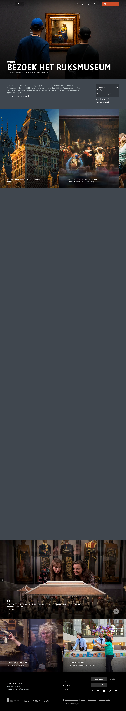

# Visitor Info Page

**URL:** `/nl/bezoek` (page title: "Bezoek het Rijksmuseum" / "Visit the Rijksmuseum") · **Occurrences:** 1 in this test run

The "plan your visit" page: practical info (hours, pricing) paired with persuasive content (why visit, testimonials). More layout variety than the Agenda page — includes a scroll-driven storytelling carousel.

## Section outline (top to bottom)

1. **[Site Header / Navigation](../components/site-header.md)**
2. **[Page Header Banner](../components/page-header-banner.md)** — "Bezoek het Rijksmuseum" title over a photo of visitors viewing a Vermeer painting, with a compact "Volwassenen / t/m 18 jaar" (Adults / Under 18) pricing summary box and a "Praktische informatie" (Practical info) link docked to the right of the intro text.
3. **[Text Intro Block](../components/text-intro-block.md)** — short paragraph ("In Amsterdam is veel te doen...") with a "Kom meer te weten over je bezoek" (Learn more about your visit) link.
4. **[Scroll-Driven Image Carousel](../components/scroll-driven-carousel.md)** — first instance: a horizontally-scrolling set of feature tiles (building exterior, gallery highlights, audio tour, café, shop, gardens, "always a free temporary exhibition").
5. **[Scroll-Driven Image Carousel](../components/scroll-driven-carousel.md)** — second instance: visitor testimonial/quote carousel ("Ongetwijfeld het mooiste museum ter wereld..." — Tripadvisor 5-star quote) with a play button, suggesting embedded video testimonials.
6. **[Two-Up Content Row](../components/two-up-content-row.md)** — two navigational tiles: "Agenda en activiteiten" (link to the Agenda page) and "Praktische info" (practical info).
7. **[Site Footer](../components/site-footer.md)**

## Content pattern

This template mixes marketing content (testimonials, feature highlights) with transactional/practical content (pricing, hours) more than either other template in this test — it's doing double duty as both a sales page and a reference page.

## Known capture gap

The first Scroll-Driven Image Carousel instance rendered as a large blank region in the screenshot (flagged automatically by the crawler — see [Scroll-Driven Image Carousel](../components/scroll-driven-carousel.md) for why). Its content above was reconstructed from the captured HTML markup, not the image.
